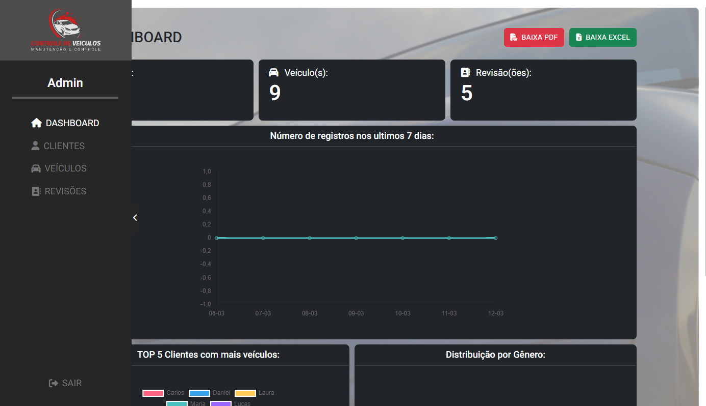
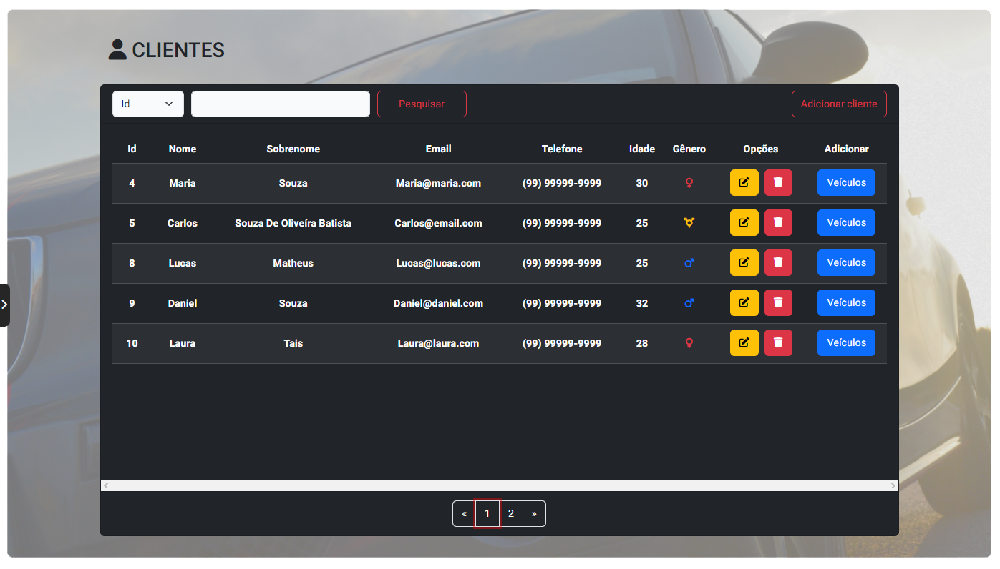
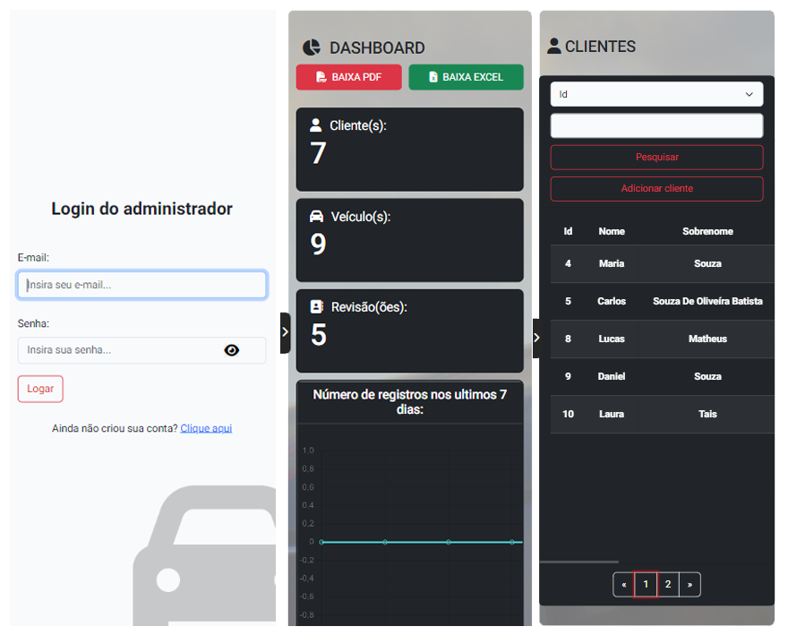

<p align="center"></p>

## Sobre projeto

Este projeto representa meu trabalho pessoal em um sistema de controle de veículos, que permite registrar informações detalhadas sobre clientes e revisões. Desenvolvi uma aplicação robusta que vai além do simples controle de veículos, proporcionando acesso a informações valiosas. Meu sistema organiza e apresenta de forma eficiente os dados e informações obtidas.

> O objetivo principal do meu projeto é fornecer um controle abrangente sobre os veículos, oferecendo funcionalidades para cadastrar clientes, veículos e revisões. Além disso, implementei um dashboard intuitivo que proporciona aos usuários uma visão geral dos dados cadastrados, permitindo uma análise rápida e eficaz.

> Meu sistema é projetado para facilitar a gestão de veículos, fornecendo uma plataforma centralizada para armazenar e acessar informações relevantes. Estou comprometido em fornecer uma solução que atenda às necessidades dos usuários, proporcionando uma experiência simplificada e eficiente na gestão de frota.


## Recursos utilizados

- Laravel
- PHP
- Bootstrap
- VueJS
- PostgreSQL
- Jquery

## Libs(Adicionais)

- Select2
- SweetAlert
- ChartJS
- Moment
- InputMask
- ExcelJS
- JSPDF

## Hospedagem

> Plataforma: https://railway.app

- [Car control](https://carcontrol-production.up.railway.app)

## Instalação

> Pacotes VueJS:

```sh
npm install
```

> Pacotes Laravel:

```sh
composer install
```

## Ativar servidor

> Servidor VueJS:

```sh
npm run dev
```

> Servidor Laravel:

```sh
php artisan server
```

## Configurando Dusk

> Execute o seguinte comando:
```sh
php artisan dusk:install
```

```sh
php artisan dusk:chrome-driver
```

> No arquivo .env, em APP_URL, Modifique para: APP_URL=http://127.0.0.1:8000

> Em caso de erro na execução do comando, na pasta "bin" na raiz deste projeto, se encontra um certificado, no qual deve-se ser inserido em: C:\caminho\php\php_versão\extras\ssl (Modifique o caminho, inserindo o local onde se encontra o pasta extras\ssl correta do PHP)

> Após colar o certificado, localize o arquivo php.ini no seu computador, abra com algum editor de texto e no final do arquivo insira a seguinte linha:
```sh
curl.cainfo = "C:\caminho\php\php_versão\extras\sslcacert.pem"
```
> (Lembrando de colocar o caminho correto onde se encontra pasta extras\ssl do PHP)

## Imagens do projeto

<p align="center"></p>
<p align="center"></p>
<p align="center"></p>
<p align="center"></p>

## Atualizações

* 1.3.5 - 🩹 Fix inputs
    * Fix name and problem input.

* 1.3.4 - 🩹 Fix rotate
    * Fix rotate in login, register and menu-nav.

* 1.3.3 - 📝 Update tables
    * Update tables

* 1.3.2 - 📝 Edit Readme
    * Edit Readme

* 1.3.1 - 🩹 Fix database query
    * Fix database query in customers, vehicles and reviews

* 1.3.0 - ✨ First deploy version
    * First deploy version

* 1.2.6 - 🩹 Fix errors
    * Fix errors

* 1.2.6 - 📝 Update service file
    * Update service file

* 1.2.5 - 📝 Update deploy file(2x)
    * Update deploy file

* 1.2.4 - 📝 Update deploy file
    * Update deploy file

* 1.2.3 - 📝 Add deploy file
    * Deploy file

* 1.2.2 - 🩹 Fixed column name and completed column
    * Fixed the column name in registers
    * Fixed complted column during the confirmation

* 1.2.1 - 📝🧪 New function for completed column
    * New function for completed column on review page
    * Updated test coverage

* 1.2.0 - 🩹📝🧪 Test coverage and pages fix/update 
    * Fixed the pagination in the table
    * Finished the first test coverage
    * Fixed bugs and errors on controllers
    * Create new factories 

* 1.1.2 - 🧪 New API test 
    * Refactoring the vehicle_data controller for the test

* 1.1.1 - 📝 Update the title on the excel page
    * Update the row style in the title

* 1.1.0 - ✨ Tests coverage and new column
    * New Plate column
    * Dusk finished
    * Updated Ids on pages

* 1.0.4 - 📝 Create account page
    * Add: delete account
    * Add: update password
    * Add: edit informations

* 1.0.3 - 📝 Update tests and styles
    * Update comments
    * Update icons
    * Update How to configure the dusk lib in ReadMe.md

* 1.0.2 - 📝 Initial tests
    * Creating tests
    * Add bin file
    * How to configure the dusk lib in ReadMe.md

* 1.0.1 - 📝 Update ReadMe.md
    * Update src

* 1.0.0 - ✨ First version
    * Releasing first version
    * Update ReadME.md
    * Update comments

* 0.5.0 - 📝 PDF and Excel page finished
    * Initial pages(PDF and Excel)
    * First style
    * Security / PDF and Excel model.

* 0.4.0 - 📝 Review page finished
    * Initial page(Reviews)
    * First style
    * Security.

* 0.3.1 - 📝 Vehicles page finished.
    * Select input.

* 0.3.0 - 📝 Add vehicles page
    * Initial page(Vehicles)
    * First style
    * Security.

* 0.2.0 - 📝 Add dashboard and customers page
    * Initial pages(Dashboard and customers)
    * Charts
    * First style
    * Security and Alert.

* 0.1.0 - 📝 Add: Login, register and home page.
    * Initial pages(Login, register and home)
    * First style
    * Authenticate and security.

* 0.0.1 - 🎉 First commit
    * Initial project.


## Informações adicionais

Euzebio Batista [@Linkedin](https://www.linkedin.com/in/euzebio-batista) - euzebio.batista2@gmail.com

Criado por **Euzebio Batista**.
**Todos os direitos reservados.**